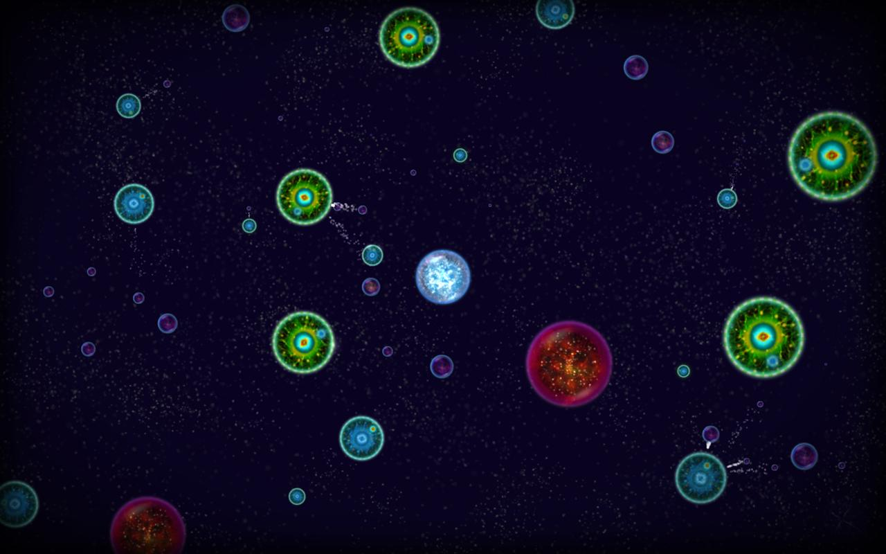
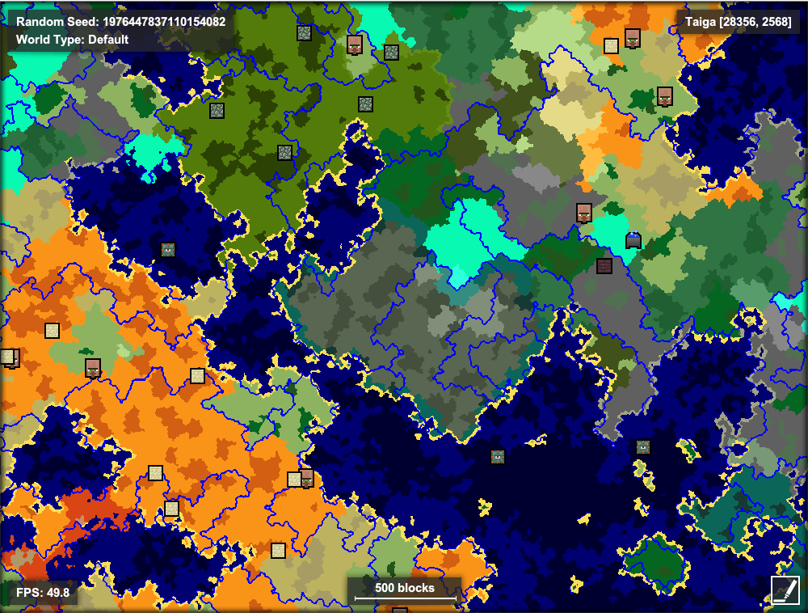
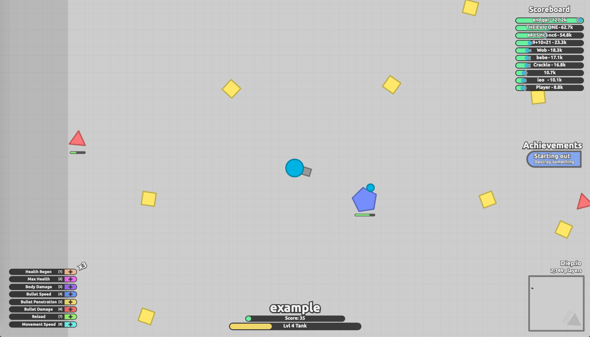

# Final Project Proposal
After some deliberation I settled on making a 2D exploration game with a generally calming feel, although quick reaction may sometimes be necessary depending on how far I get with the combat mechanics. I chose this because it's an open-ended concept that can succeed either as an exploration or fighting game and doesn't require much in the way of art skills. Furthermore, I've always been fascinated by world generation and this assignment presents an opportunity for me to implement the basics, which I can then use in future projects. It's also an opportunity for me to make something slower-paced, which will encourage me to focus on the aesthetics rather than implementing new mechanics. I aim to combine the generative methods similar to a game like Minecraft with an aesthetic holding some resemblance to a game like Osmos.

The user experience will be mostly exploratory; they'll roam the world in search of a safer or more interesting area, or for better weapons/equipment (if I have time to implement those). I hope to at least add some enemies and a couple of basic player attacks to the game because this would force the player to make tactical decisions about where to run and where to make a stand, and these moments would be interspersed with exploring the world. The music will reflect this dynamic, with a calm track being overlaid by a more intense one when enemies are closing in on the player. I'm more concerned with making each biome feel unique and immersive than with making the game feel substantially different from beginning to end (there may or may not be an end).

I'll implement this project in p5.js. The mechanics will be as follows. The player will be a simple sprite such as a circle, and will be able to move around an infinite world using either bi-directional or tank controls. There will be various walls in the world, the general shape of which will be determined by a noise function, with some post-processing to make them look smooth and organic (this will probably be the trickiest part); right now I'm hoping to make the walls mostly solid-colored and blob-shaped. The shape and arrangement of the walls is determined by the biome which they're in, and another noise function will map biomes to certain areas of the world (see the screenshot below). For example, one biome might be relatively open with only a few walls, while another might feature lots of long and thin walls. Ideally there will also be enemies spawning in and chasing the player, the player will have various ways of defending themselves, and there will be some sort of end state to the game (perhaps a text popup when the player has explored every main feature of the level). I'll implement these features as I have time, but getting the walls and biomes to look the way I want is my biggest priority.

## Schedule

| Week 1 | Week 2 | Week 3 |
| ------ | ------ | ------ |
| Get an object moving around a screen with a noise texture in the background. Maybe get started on the walls. | Get walls which spawn according to noise and biome noise. The walls should look alright but not great. Add some basic enemies to the game. | Add player weapons/abilities and BGM/SFX; refine noise, enemy AI and walls. |

## Screenshots
A screenshot of Osmos, taken from [here](https://cafebazaar.ir/app/com.hemispheregames.osmosdemo/?l=en). There will be actual walls in my game instead of just circles that suck away your mass, but the atmosphere will hopefully be similar.

Minecraft 1.12 biome placement, viewed using Amidst. Each biome is a different shade. Lots of biomes can be seen here, but my desired result will only contain a few biomes.

The start of a diep.io game. The style of this game is more cartoony than what I'm going for, but the feel of moving and attacking is somewhat of an inspiration for my game.

